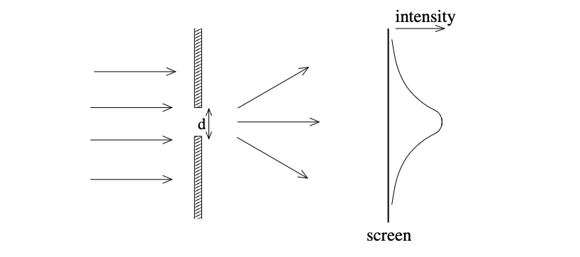
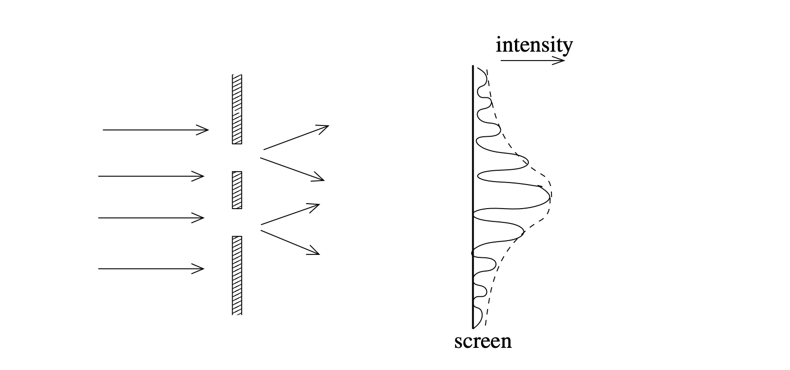
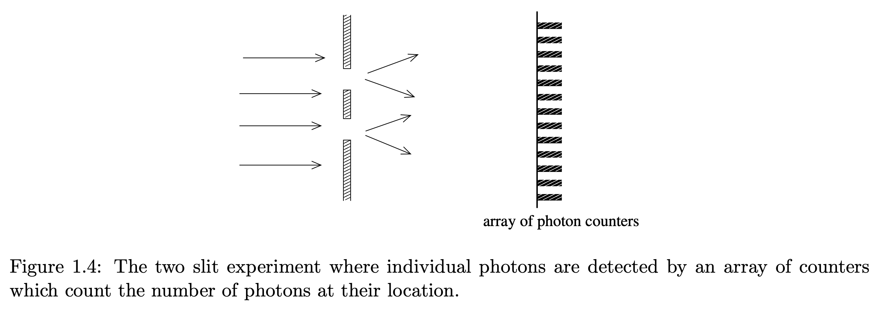
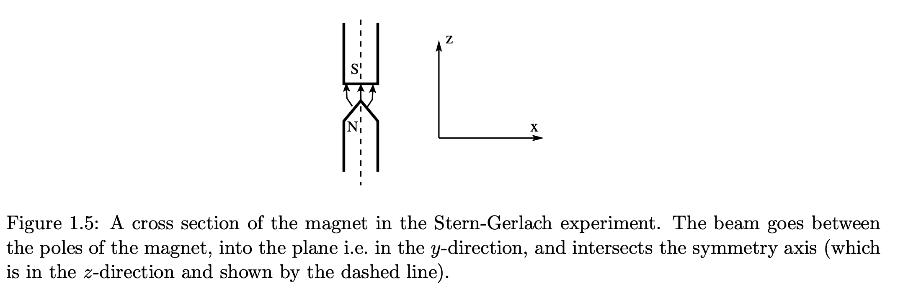
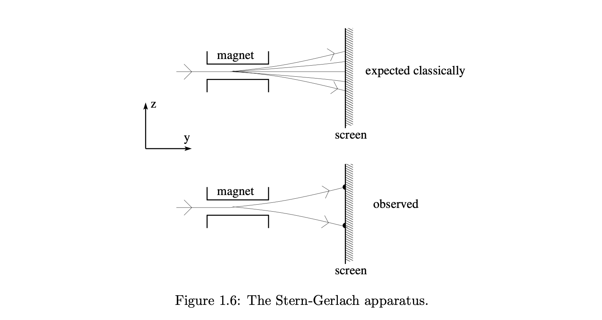
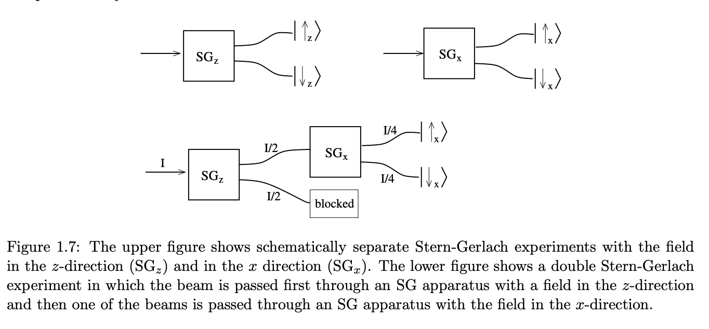
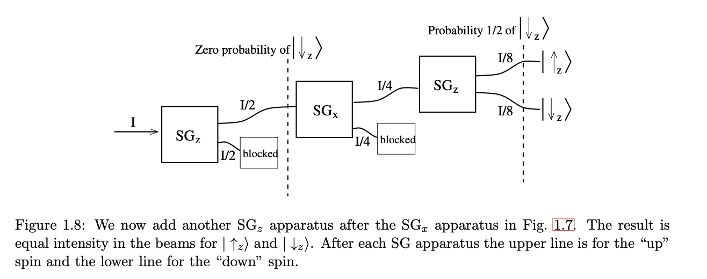

# Quantum Mechanics

A quantum computer, then, is one in whcih data is processed by quantum. so , for quantum computer it must obey the rules of quantum mechanics.

## Superposition (叠加原理)
In classical computer, data is processed by binary bits. but in quantum computer, data is processed by quantum bits. The difference between them is that quantum bits can be in **superposition** of states, while binary bits can only be in one of the two states.
> Superposition: A quantum system can be in $ | 0\rangle$ and $ |1\rangle $ states at the same time. $$ |\psi \rangle = \alpha |0\rangle + \beta |1\rangle $$.where $ \alpha $ and $ \beta $ are **complex numbers**.

## The Two-Slit Experiment 
The Two-Slit Experiment demonstrates **that light is a wave**. shows interference.

### One-Slit 
* if the slit width $\mathbf{d}$ is very large compared with the wavelength $\lambda$, then the light continues in a **straight line**. $$ \mathbf{straight \space line} :\space d >\lambda $$
* if the slit width $\mathbf{d}$ is comparable to, or less than, $\lambda$, the light spreads out after passing through the slit, which is called **diffraction**. $$ \mathbf{diffraction} :\space d \approx \lambda \space ;d<\lambda $$

in this figure, we only consider one slit. (A beam of light spreads out (diffracts) when passing though a slit of width $\mathbf{d}$ which is
comparable to, or smaller than, the wavelength of the light $\lambda$.)

### Two-Slit

A two slit experiment. Interference fringes, **oscillations of strong and weak intensity**, are
seen due **destructive** and **constructive interference**.

If the light beam passes two slits, as shown in Fig. 1.2 one observes **interference fringes(干涉边缘)**, oscillations
of strong and weak intensity, due to interference between between the beams going through the two
slits.

and those interference has below properties:
* **destructive interference** : when the two waves are out of phase, their amplitudes cancel each other out, resulting in a zero intensity at the interference fringes. The difference in path length $ |r_1 - r_2 |$ satisfies $ \Delta r = n + \frac{1}{2} \lambda $, where $ n $ is an integer. has a minmum intensity.

* **constructive interference** : when the two waves are in phase, their amplitudes add up, resulting in a maximum intensity at the interference fringes.  and, The difference in path length $ |r_1 - r_2 |$ satisfies $ \Delta r = n \lambda $, where $ n $ is an integer. has a maximum intensity .

>Now we reduce the intensity of the light. At some point we notice that light is not a continuous
wave but consists of discrete bunches of energy called photons. To detect individual photons, we place
an array of photon counters on the screen and count the number of discrete clicks in each counter, see
Fig. 1.4. We record the number of clicks for counters placed at different points on the screen.

> "Suppose we reduce the intensity so much that the time between emitting(发射) photons is greater than the time it takes a photon to pass through the experimental setup, i.e. the photons go through one at a time. Do we see an interference pattern? Using our classical intuition we would say “no” because surely each photon “must” either go through the upper slit or the lower one and can therefore not interfere with itself. In other words we would expect the intensity of clicks in the counters to vary smoothly along the screen, as in the classical single slit experiment shown in Fig." 

* In the two-slit experiment, even though the photons go through one *at a time*. they still shows the *interference* . 
* According this experiment, we noticed the photons that looks like a superposition state.

## Why we don't observe the photon go through which slit?
> photons
being electrically neutral are hard to observe unless we absorb them (which we want to do only when
they reach the screen). The rate of scattering of one photon by another is immeasurably small. So, with
photons we can’t observe which slit they went though.

However, we can do the same experiment with
electrons rather than photons. Like photons, electrons have both **particle and wave-like properties** (波粒二象性)，but, being charged, they readily scatter（散射） light so we can see observe them by shining light on them. 【带电电子容易散光，因此需要使用光束照射来进行观察】
## Chose the electron insted of photon ? （电子的双缝干涉实验以说明观测测量导致量子的叠加态发生坍缩）

* Two slits
* Electron  
* Wavelength $\lambda  < d $ 

We sent electron through the slits at one time, To see which slit they went through we shine the light of wavelength $\lambda$ at the slit and observe a flash of light every time an electron goes through.

Due to the diffraction if the wavelength more than slit's width ($\lambda > d$), so wavelength must be small than the width of slit.$$ \lambda < d $$
When we do this, indeed we see a flash at either the upper slit or the lower slit every time an electrons
passes. when
we look at the counts registered on the detectors we see that **the interference fringes have been washed
out, and we have just a smooth variation in the number of clicks along the screen**. Observations such
as these show that it is not possible to determine which slit each electron goes through and observe
interference fringes.
This observation guides us to a **second piece of intuition regarding quantum mechanics** (the first,
mentioned above, is that a quantum system can be in a superposition state), namely that **a measure-
ment can unavoidably change a quantum state, and in particular can destroy a superposition.**
 

## Stern-Gerlanch Experiment
Suppose we have hydrogen atoms, which consists of one proton, which has a positive charge. and one electron, which has a negative charge.
> 假设我们有氢原子，其由带正电荷的质子和带有负电荷的电子组成。

In ground state the electron has a symmetric distribution of velocities, (which means that the electron can be found at any position with equal probability.) and so there is  no net circulating electric current around the proton（质子） Hence the orbital motion of the electron does not give rise to a magnetic moment which could interact with an external magnetic field. (因此，电子的轨道运动不会产生可能与外部磁场相互作用的磁矩。) 
But the electron has a internal state: a non-zeron **spin** (自旋), whcih does give rise to a magnetic moment $ \bar{\mu}$, proportional to the spin angular momentum.(与角动量成正比)
> 基态电子由于速度对称性分布因此质子附近不会存在净循环电流，因此，电子轨道的运动不会与外部磁场进行交互产生磁矩。但是单个电子内部具有自旋，自旋会与外部磁场进行交互，产生磁矩 $\bar{\mu}$。同时，该磁矩与角动量成正比关系。

如果场是非均匀的，在场中的磁矩上会存在一个力，为了引入这个力，我们需要首先记住在磁场$\bar{B}$中的磁矩的能量由以下给出($U$表示磁偶极子$\mu$在磁场$B$中的势能)： 【[Gemini](https://gemini.google.com/share/54ffd46e38dd)】
 $$U =  - \bar{\mu}\cdot \bar{B}$$  $$ \bar{F} = \nabla(\bar{\mu}\cdot\bar{B})  \\ \space \\ F_{z} = \bar{\mu} \cdot \frac{d\bar{B}}{dz}$$ 我们假设，在不失去一般性的情况下，场作为z的函数而变化。因此，在非均匀磁场中的z方向上变化的氢原子束将在z方向上偏转
为了简化起见，我们假设场的主要方向也在z方向上。因此偏转与$\mu_{z}$成正比：$$ F_{z} = \frac{d B_{z}}{dz} \cdot \mu_{z}$$

> 何为角动量？就像动量$ p$一样，动量描述了“包含多少平移运动”角动量描述的是“包含多少旋转运动”。经典力学中，角动量定义为：$$ \vec{L} = \vec{r} \times \vec{p}$$连接物体与其相关的坐标原点构成向量$\vec{r}$为位置矢量，（该位置矢量不是属于物体本身的性质，而只取决于所取的参考系）。当动量$ \vec{p}$与$\vec{r}$不平行时，物体就有绕着中心轴转圈的趋势。基于安培的设想，带磁矩的粒子可以被想象成一个点电荷绕着固定的轴旋转（匀速圆周运动）角速度为$\vec{\omega}$位置矢量为$\vec{r}$。对轨道上的一个小截面，每隔周期$T$ 就通过电荷$e$ ,则平均电流为$$ I = \frac{e}{T} = \frac{\omega e}{2\pi}$$这样产生一个点流圈，其半径为$ r$电流为$I$ ，其在磁场中受到合安培力为0，但力矩非零：$$ \vec{M} = I\pi r^{2} \vec{e_{n}} \times \vec{B}$$其中：$$ I\pi r^2\vec{e_{n}}$$称为磁矩，$\vec{e_{n}}$为通过对电流用右手螺旋准则得到的单位矢量。：$$\vec{\mu} = I\pi r^2\vec{e_{n}} = \frac{1}{2} e\omega r^2 \vec{e_{n}}$$ 由此，$$\vec{L} = m\vec{r} \times (\vec{\omega} \times \vec{r}) = m\omega r^2 \vec{e_{n}}$$得到：$$\vec{\mu} = \frac{e}{2m} \vec{L}$$即，磁矩正比于角动量，比例系数称为**旋磁比**.上面提到的角动量是指的**轨道角动量**。另外还有自旋角动量。

For simplicity, we assume the field itself is also (predominantly) along the z-direction: 

> 如上图所示， 这是磁体的横截面， 我们的氢离子束将会沿着y方向射出并穿过不均匀磁场，并与对称轴z相交。

> 我们发送一束未偏振的氢原子进非均匀磁场中，由于磁矩$\bar{\mu}$的方向是随机的，理论上我们将会在最终的幕上看到取一系列值的$\bar{\mu_{z}}$。但事实是我们仅仅观察到存在两束电子束。由于磁矩$ \bar{\mu}$ 与电子自旋成正比，因此沿着z的自旋分量似乎只有两个分量，对应于我们可能分别标记为$| ↑ z \rangle $  和$| ↓z\rangle $的状态，或者分别标记为$|0\rangle $和$ |1\rangle$
现在，我们假设旋转磁体的方向到x方向，结果上我们将会再看到两束电子束，这表示，电子自旋产生的磁矩$\vec{\mu_{x}}$有且仅有两个可能的值:$$ | ↑x\rangle$$ 和$$ | ↓x\rangle$$

> $ | ↓x\rangle$ $ | ↑x\rangle$ 与 $ |↑ z\rangle$ 和$|↓z\rangle$的关系：

---

It looks as though $|\uparrow_z\rangle$ can be thought of as $|\uparrow_x\rangle$ with probability $1/2$ and $|\downarrow_x\rangle$ with probability $1/2$. We will see in a future lecture that $|\uparrow_z\rangle$ is actually a superposition of $|\uparrow_x\rangle$ and $|\downarrow_x\rangle$ as follows:

$$|\uparrow_z\rangle = \frac{1}{\sqrt{2}}(|\uparrow_x\rangle + |\downarrow_x\rangle), \quad (1.5)$$

where we say that there is an *amplitude* $1/\sqrt{2}$ for $|\uparrow_z\rangle$ to be $|\uparrow_x\rangle$ and amplitude $1/\sqrt{2}$ for it to be $|\downarrow_x\rangle$. As we shall also see later, the probability that a measurement gives a certain result is the square of the modulus of corresponding amplitude, so the probability of measuring $|\uparrow_x\rangle$ after the $SG_x$ apparatus is $1/2$ (as observed) and the same for $|\downarrow_x\rangle$.

It is also true that

$$|\uparrow_x\rangle = \frac{1}{\sqrt{2}}(|\uparrow_z\rangle + |\downarrow_z\rangle), \quad (1.6)$$

so if we run one of the beams from the $SG_x$ apparatus in Fig. $1.7$ through another $SG_z$ apparatus we will get beams with equal intensity for $|\uparrow_z\rangle$ and $|\downarrow_z\rangle$, see Fig. $1.8$. Note a surprising aspect of this result. After the first $SG_z$ apparatus, there is zero probability for getting $|\downarrow_z\rangle$ (because we blocked it off), but after the $SG_x$ apparatus there is a $50\%$ probability for finding $|\downarrow_z\rangle$. In other words, a non-zero probability for getting $|\downarrow_z\rangle$ has been *generated* by the measurement. This is a clear example of a measurement (in this case that done by the $SG_x$ apparatus) affecting the state of the system.

---

### 中文翻译

看起来可以将 $|\uparrow_z\rangle$ 视为以 $1/2$ 的概率处于 $|\uparrow_x\rangle$ 态，以 $1/2$ 的概率处于 $|\downarrow_x\rangle$ 态。我们在未来的课程中将会看到，实际上 $|\uparrow_z\rangle$ 是 $|\uparrow_x\rangle$ 和 $|\downarrow_x\rangle$ 的叠加，如下所示：

$$|\uparrow_z\rangle = \frac{1}{\sqrt{2}}(|\uparrow_x\rangle + |\downarrow_x\rangle), \quad (1.5)$$

在这里，我们称 $|\uparrow_z\rangle$ 处于 $|\uparrow_x\rangle$ 态的*振幅*（amplitude）为 $1/\sqrt{2}$，处于 $|\downarrow_x\rangle$ 态的振幅也为 $1/\sqrt{2}$。正如我们稍后将看到的，**测量给出特定结果的概率是对应振幅模的平方**，因此在经过 $SG_x$ 装置后，测量得到 $|\uparrow_x\rangle$ 的概率为 $1/2$（正如所观察到的），得到 $|\downarrow_x\rangle$ 的概率也相同。

同样成立的是：

$$|\uparrow_x\rangle = \frac{1}{\sqrt{2}}(|\uparrow_z\rangle + |\downarrow_z\rangle), \quad (1.6)$$

因此，如果我们让图 $1.7$ 中 $SG_x$ 装置出来的一束光束通过另一个 $SG_z$ 装置，我们将得到强度相等的 $|\uparrow_z\rangle$ 和 $|\downarrow_z\rangle$ 光束，见图 $1.8$。请注意该结果中令人惊讶的一面：在第一个 $SG_z$ 装置之后，得到 $|\downarrow_z\rangle$ 的概率为零（因为我们将其挡住了），但在经过 $SG_x$ 装置后，发现 $|\downarrow_z\rangle$ 的概率变成了 $50\%$。换句话说，得到 $|\downarrow_z\rangle$ 的非零概率是由测量*产生*的。**这是一个测量（在此例中为 $SG_x$ 装置所做的测量）影响系统状态的清晰示例。**

# Photons

在上一节中，我们提到电子的自旋是一个二能级量子系统。在这里，我们将讨论另一个二能级量子系统——光（即光子）。

光是一种振荡的横向电磁场，其中电场 $\vec{E}$ 和磁场 $\vec{B}$ 彼此垂直，且都垂直于由波矢量 $\vec{k}$ 指定的传播方向。例如，如果 $\vec{E}$ 沿 $x$ 方向，$\vec{B}$ 沿 $y$ 方向，而 $\vec{k}$ 沿 $z$ 方向，则我们有：

$$\vec{E} = E_0 \hat{x} e^{i(kz-\omega t)},$$
$$\vec{B} = B_0 \hat{y} e^{i(kz-\omega t)}.$$

$\vec{E}$ 的方向被称为偏振方向。有两种不同的偏振，我们可以称之为“水平”偏振（沿 $\hat{x}$ 方向）：

$$|\leftrightarrow\rangle, \quad \text{等价于 } |\uparrow_z\rangle \equiv |0\rangle, \quad (1.8)$$

以及“垂直”偏振（沿 $\hat{y}$ 方向）：

$$|\updownarrow\rangle, \quad \text{等价于 } |\downarrow_z\rangle \equiv |1\rangle. \quad (1.9)$$

那么，$|\uparrow_x\rangle$ 和 $|\downarrow_x\rangle$ 的模拟对应物是什么呢？答案是**对角偏振**：

$$|\nearrow\rangle \equiv \frac{1}{\sqrt{2}}(|\updownarrow\rangle + |\leftrightarrow\rangle), \quad \text{等价于 } |\uparrow_x\rangle \equiv \frac{1}{\sqrt{2}}(|0\rangle + |1\rangle), \quad (1.10)$$
$$|\searrow\rangle \equiv \frac{1}{\sqrt{2}}(|\updownarrow\rangle - |\leftrightarrow\rangle), \quad \text{等价于 } |\downarrow_x\rangle \equiv \frac{1}{\sqrt{2}}(|0\rangle - |1\rangle).$$

关于光子偏振与量子比特（qubit）态之间对应关系的更多细节将在第 4.1 节中给出。

光子之间不会发生可观测的相互作用，也不易于储存，因此它们不适用于大多数类型的量子计算机。但光子具有一个优势：它们可以在光纤中进行长距离传输，同时保持其偏振状态不变。这些特性对于第 21 章中将讨论的一些量子协议非常有用。